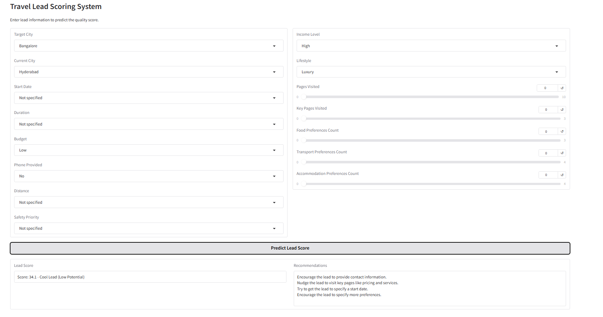
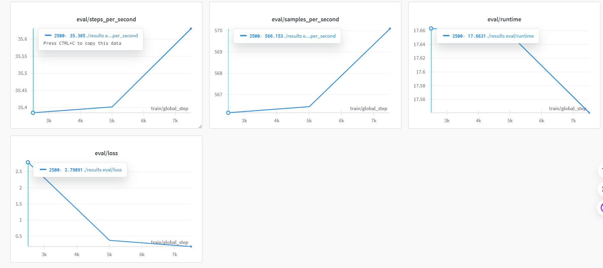

# SwiftAid

## Utilizing Google Analytics 4 (GA4) Free Tier for Analytics & User Behavior Tracking

## Refined SwiftAid Concept with AI-Driven Lead Management & ML Models

### Core Business Concept

SwiftAid is an AI-powered urban relocation and city exploration platform designed to provide **end-to-end assistance** for people moving to or visiting new cities. The platform integrates **machine learning (ML) models** for personalized recommendations and an advanced **lead management system** to capture, nurture, and convert potential users effectively.

### Integrated Solution Architecture

#### 1. Core SwiftAid Services

##### Relocation Assistance
- AI-driven **housing recommendations**
- Automated **utility setup assistance**
- Local **registration guidance**
- **ML-based** school/workplace proximity analysis

##### City Exploration
- **AI-powered itinerary planning**
- **ML-based local experience curation**
- Safety-first **route planning**
- Personalized **cultural integration assistance**

##### 360° Security Services
- **Emergency response system integration**
- Healthcare provider network suggestions
- Real-time **personal safety monitoring**
- Insurance coordination via predictive analytics

##### Lifestyle Management
- AI-enhanced **hotel bookings**
- ML-powered **restaurant recommendations**
- Smart **grocery delivery planning**
- AI-driven **medical appointment scheduling**

#### 2. Integrated Lead Management System

##### Lead Capture Integration Points:

###### Website Touchpoints
- AI-enhanced **pre-move inquiry forms**
- **Dynamic city exploration planners**
- Personalized **service package configurators**
- Smart **safety plan subscriptions**

###### Multi-channel Lead Collection
- Website forms
- Mobile app registrations
- Partner referrals
- Social media inquiries
- **WhatsApp Business integration with AI chatbots**

###### AI-Powered Lead Scoring
- **Move timeline prediction model**
- **Service package interest clustering**
- **Budget prediction using regression models**
- **Location preference modeling**
- **Safety service demand forecasting**

###### Intelligent Engagement
- **AI-based personalized service recommendations**
- Custom relocation packages
- **Dynamic safety plan suggestions**
- **City-specific service optimizations**

#### 3. Sales Enhancement Strategy

##### A. Lead Qualification (ML-Driven)

ML models score leads based on:
- **Relocation timeline prediction**
- **Clustering based on service interests**
- **Budget classification using decision trees**
- **Complexity scoring of required services**
- **Geographic preference learning**

##### B. Automated Marketing Workflows

###### Pre-Move Phase
- AI-generated **city guides**
- Personalized **safety tips**
- **Cost calculators trained on market trends**
- Automated **preparation checklists**

###### Active Planning Phase
- **ML-powered service package comparisons**
- **Computer vision-enhanced virtual city tours**
- Predictive **safety plan optimization**
- Smart **accommodation options**

###### Post-Move Support
- AI-driven **local community integration insights**
- Automated **service feedback collection**
- Personalized **additional service suggestions**
- ML-based **loyalty program recommendations**

##### C. AI-Driven Sales Optimization

###### Predictive Analytics
- ML-enhanced **service package recommendations**
- **Dynamic pricing optimization**
- AI-driven **cross-selling opportunities**
- **Retention risk assessment models**

###### Conversation Intelligence
- AI-based **customer interaction analysis**
- **Sentiment tracking via NLP models**
- **Service satisfaction monitoring**
- ML-powered **feedback-based improvements**

#### 4. Technical Implementation

The system is built using modern **web and AI technologies** to ensure scalability, performance, and maintainability:

- **Next.js** for the frontend
- **Node.js backend services**
- **AI/ML integration for lead scoring and recommendations**
- **Real-time analytics and monitoring using GA4**
- **Secure API infrastructure with JWT authentication**
- **Mobile-first responsive design**

#### 5. Machine Learning Models Integrated

| Model | Purpose | Algorithm Used |
|--------|------------------------------|----------------|
| **Lead Scoring Model** | Predicts lead conversion probability | Gradient Boosting |
| **Budget Prediction Model** | Estimates user budget range | Linear Regression |
| **Personalized Recommendations** | Suggests relocation services | Collaborative Filtering |
| **Sentiment Analysis** | Analyzes customer interactions | NLP (BERT) |
| **Dynamic Pricing Model** | Adjusts service pricing based on demand | XGBoost |

#### 6. Screenshots

---
### Conclusion
SwiftAid leverages **AI, ML, and advanced analytics** to provide a seamless relocation and city exploration experience. The integration of predictive modeling and AI-driven insights ensures higher lead conversion and a **personalized user journey**.

Let me know if you need any refinements or additional details!

